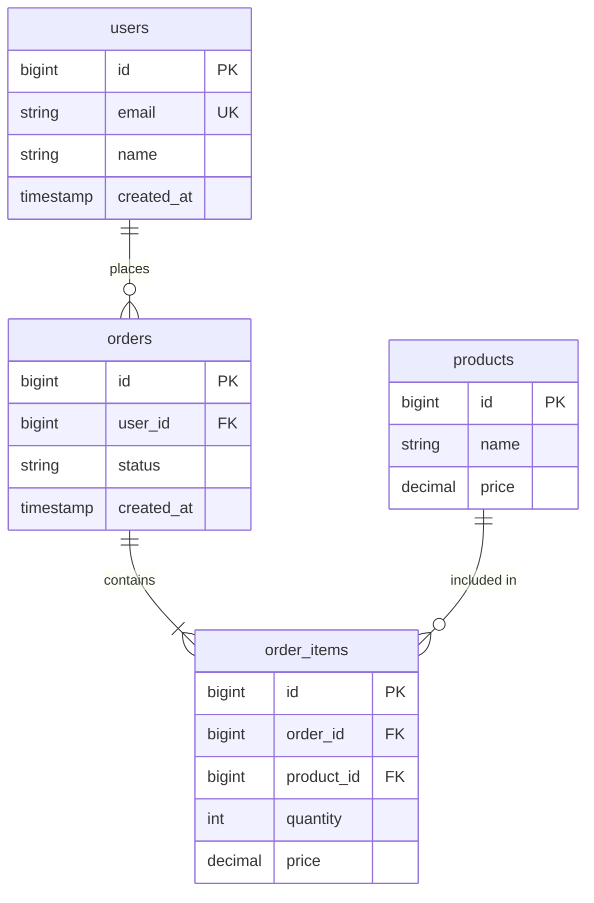

# DB定義書：{DB名 / システム名}

> **メタ情報**
> - ドキュメントID: {DB-XXX}
> - バージョン: {1.0}
> - 作成日: {YYYY-MM-DD}
> - 最終更新: {YYYY-MM-DD}
> - 作成者: {名前}
> - レビュー状況: {Draft / Reviewed / Approved}
> - 関連基本設計書: {DOC-XXX}
> - DB種別: {PostgreSQL / MySQL / SQLite / DynamoDB 等}
> - バージョン: {PostgreSQL 16 等}

---

## 1. 概要

### 1-1. 目的
{DBが何を保持し、どう使われるか}

### 1-2. 適用範囲
{含むテーブル / 含まないテーブル}

### 1-3. 命名規約
| 対象 | 規約 | 例 |
|---|---|---|
| テーブル | {スネークケース・複数形} | users, order_items |
| カラム | {スネークケース} | user_id, created_at |
| インデックス | {idx_{table}_{cols}} | idx_users_email |
| 外部キー | {fk_{table}_{ref}} | fk_orders_users |
| 主キー | {pk_{table}} | pk_users |

---

## 2. ER図

### 2-1. 全体ER図

### 2-2. エンティティ関係の補足
| 関係 | 多重度 | ビジネス意味 |
|---|---|---|
| users — orders | 1対多 | {1ユーザーが複数注文} |
| orders — order_items | 1対多 | {1注文に複数明細} |
| products — order_items | 1対多 | {1商品が複数明細に登場} |

---

## 3. テーブル定義

### 3-1. {テーブル名: users}

#### 論理/物理名
- **論理名**: {ユーザー}
- **物理名**: `users`

#### 説明
{ユーザーアカウントを保持するマスタテーブル}

#### カラム定義
| # | 論理名 | 物理名 | データ型 | 長さ | NULL | デフォルト | 主キー | 一意 | 備考 |
|---|---|---|---|---|---|---|---|---|---|
| 1 | ID | id | BIGSERIAL | — | × | — | ○ | — | 自動採番 |
| 2 | メール | email | VARCHAR | 255 | × | — | — | ○ | ログインID |
| 3 | 名前 | name | VARCHAR | 100 | × | — | — | — | — |
| 4 | 作成日時 | created_at | TIMESTAMP | — | × | now() | — | — | — |
| 5 | 更新日時 | updated_at | TIMESTAMP | — | × | now() | — | — | トリガ更新 |

#### 制約
| 制約名 | 種別 | 対象カラム | 参照先 |
|---|---|---|---|
| pk_users | PRIMARY KEY | id | — |
| uk_users_email | UNIQUE | email | — |

#### インデックス
| インデックス名 | カラム | 種別 | 用途 |
|---|---|---|---|
| uk_users_email | email | UNIQUE | {ログイン検索} |
| idx_users_created_at | created_at | BTREE | {期間絞り込み} |

---

### 3-2. {テーブル名: orders}
{同フォーマットで繰り返し}

#### カラム定義
| # | 論理名 | 物理名 | データ型 | 長さ | NULL | デフォルト | 主キー | 一意 | 備考 |
|---|---|---|---|---|---|---|---|---|---|
| 1 | ID | id | BIGSERIAL | — | × | — | ○ | — | — |
| 2 | ユーザーID | user_id | BIGINT | — | × | — | — | — | FK → users.id |
| 3 | ステータス | status | VARCHAR | 20 | × | 'pending' | — | — | 列挙: pending/paid/shipped/done/cancelled |
| 4 | 合計金額 | total_amount | DECIMAL | 10,2 | × | 0 | — | — | — |
| 5 | 作成日時 | created_at | TIMESTAMP | — | × | now() | — | — | — |

#### 制約
| 制約名 | 種別 | 対象カラム | 参照先 |
|---|---|---|---|
| pk_orders | PRIMARY KEY | id | — |
| fk_orders_users | FOREIGN KEY | user_id | users(id) ON DELETE RESTRICT |
| ck_orders_status | CHECK | status | status IN ('pending','paid','shipped','done','cancelled') |

---

## 4. 正規化・非正規化の方針

### 4-1. 正規化レベル
{第3正規化まで適用。以下の例外を除く}

### 4-2. 非正規化の例外
| 対象 | 非正規化内容 | 理由 | 整合性維持方法 |
|---|---|---|---|
| orders.total_amount | 明細合計を保持 | {集計クエリ回避} | {トリガで更新} |

---

## 5. インデックス設計

### 5-1. インデックス一覧
| テーブル | インデックス名 | カラム | 種別 | 想定クエリ | 選択性 |
|---|---|---|---|---|---|
| users | uk_users_email | email | UNIQUE | WHERE email = ? | 高 |
| orders | idx_orders_user_id | user_id | BTREE | WHERE user_id = ? | 中 |
| orders | idx_orders_status_created | status, created_at | BTREE | WHERE status = ? ORDER BY created_at | 中 |

### 5-2. インデックス設計方針
- {検索条件・結合条件・ソート条件に使用するカラムに付与}
- {書き込み頻度の高いテーブルでは過剰インデックスを避ける}
- {複合インデックスは左端プレフィックスを意識}

---

## 6. トランザクション・一貫性設計

### 6-1. トランザクション境界
| 処理 | 対象テーブル | 分離レベル | 一貫性レベル | 備考 |
|---|---|---|---|---|
| 注文作成 | orders, order_items | Read Committed | ACID | {在庫確認と同トランザクション} |

### 6-2. 楽観/悲観ロック方針
| 対象 | 方式 | 理由 |
|---|---|---|
| {在庫} | {楽観ロック（version）} | {競合稀・高スループット} |
| {口座残高} | {悲観ロック（SELECT FOR UPDATE）} | {競合多・強一貫性} |

---

## 7. パーティショニング・シャーディング

### 7-1. パーティショニング
| テーブル | 方式 | パーティションキー | 粒度 | 備考 |
|---|---|---|---|---|
| {logs} | {RANGE} | {created_at} | {月次} | {古いパーティションはアーカイブ} |

### 7-2. シャーディング（必要時のみ）
{シャードキー・方式・ルーティング}

---

## 8. データライフサイクル

### 8-1. 生成
{いつ・どのモジュールが}

### 8-2. 更新
{いつ・どのモジュールが}

### 8-3. 参照
{参照頻度・クエリパターン}

### 8-4. 削除・アーカイブ
| 対象 | 方式 | 保持期間 | 実行タイミング |
|---|---|---|---|
| {論理削除} | {deleted_atフラグ} | {無期限} | — |
| {ログ} | {物理削除} | {1年} | {月次バッチ} |

---

## 9. マイグレーション・移行

### 9-1. 初期スキーマ
{マイグレーションツール: Flyway / Liquibase / Prisma Migrate 等}

### 9-2. 後方互換性維持方針
- {カラム追加は nullable またはデフォルト付き}
- {カラム削除は2リリース遅れで実施}
- {型変更は新カラム追加→移行→旧カラム削除}

### 9-3. シードデータ
| テーブル | データ | 用途 |
|---|---|---|
| {roles} | {admin, user, guest} | {初期ロール} |

---

## 10. バックアップ・リカバリ

| 項目 | 方針 |
|---|---|
| バックアップ方式 | {論理+物理 / PITR} |
| 頻度 | {日次フル・時間差分} |
| 保持期間 | {30日} |
| RTO | {4時間} |
| RPO | {1時間} |
| リカバリ手順 | {手順書リンク} |

---

## 11. 要件との対応

| 要件ID | 対象テーブル | 備考 |
|---|---|---|
| {US-001} | users, orders | {対応内容} |

---

## 12. 未解決事項・後追い課題

- [ ] {課題1}

---

## 変更履歴

| バージョン | 日付 | 変更者 | 変更内容 |
|---|---|---|---|
| 1.0 | {YYYY-MM-DD} | {名前} | 初版作成 |