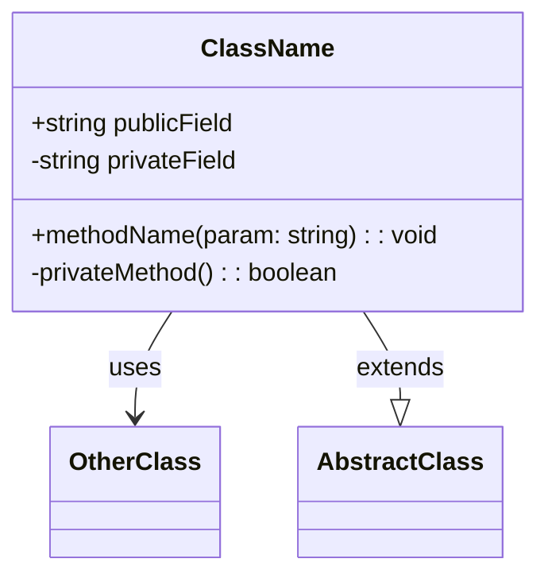
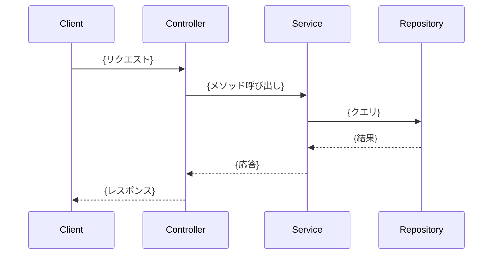
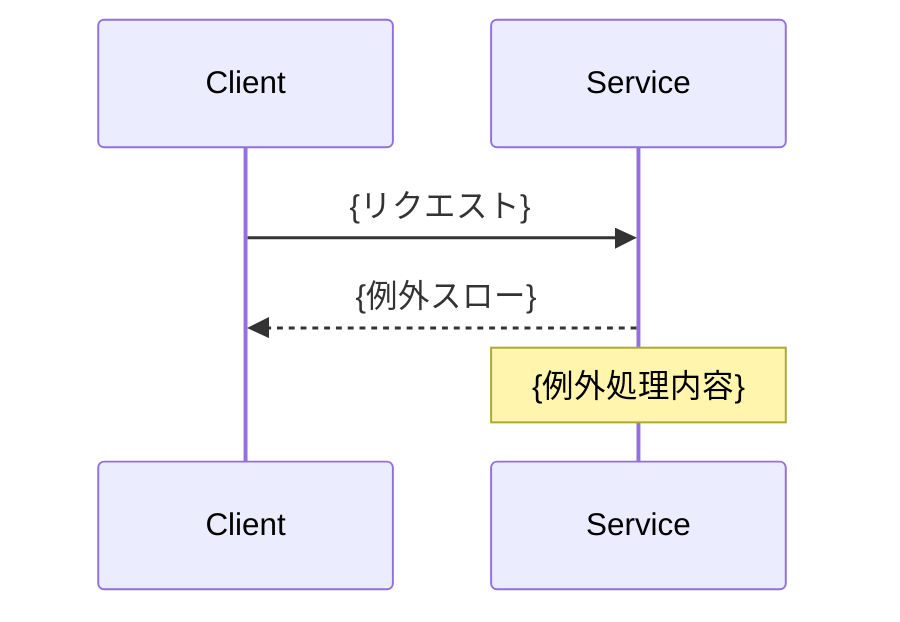
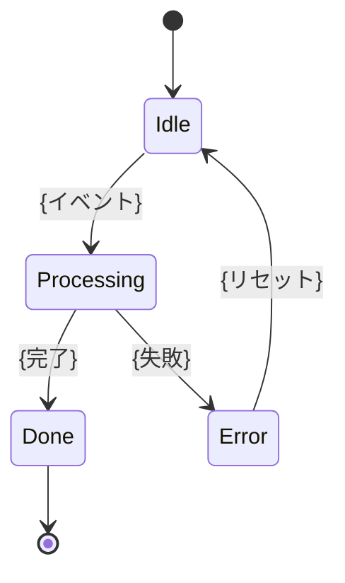
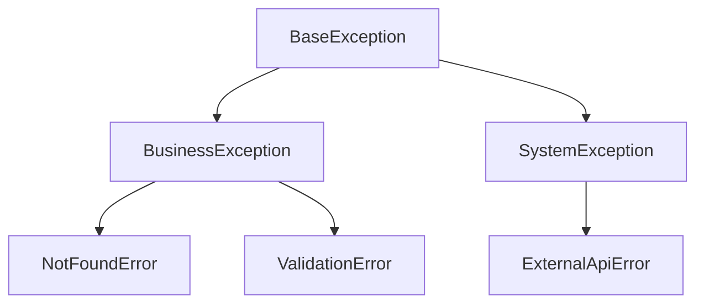

# 詳細設計書：{システム名} — {モジュール名}

> **メタ情報**
> - ドキュメントID: {DET-XXX}
> - バージョン: {1.0}
> - 作成日: {YYYY-MM-DD}
> - 最終更新: {YYYY-MM-DD}
> - 作成者: {名前}
> - レビュー状況: {Draft / Reviewed / Approved}
> - 関連基本設計書: {DOC-XXX（システム設計書）}
> - 関連要件定義書: {REQ-XXX}

---

## 1. 概要

### 1-1. 目的
{本詳細設計書が対象とするモジュール・機能。基本設計との対応}

### 1-2. 適用範囲
{含むモジュール / 含まないモジュール}

---

## 2. モジュール構成

### 2-1. モジュール一覧
| モジュールID | モジュール名 | 責務 | 親モジュール | 依存先 |
|---|---|---|---|---|
| M-001 | {モジュール名} | {責務} | {親} | {依存モジュールID} |

### 2-2. モジュール依存図

```mermaid
graph TB
  M001[M-001: {モジュール名}] --> M002[M-002: {モジュール名}]
  M002 --> M003[M-003: {モジュール名}]
```

---

## 3. クラス設計

### 3-1. クラス一覧
| クラスID | クラス名 | 種別 | 責務 | 所属モジュール |
|---|---|---|---|---|
| C-001 | {クラス名} | {Entity / Service / Adapter / Controller} | {責務} | M-001 |

### 3-2. クラス図



### 3-3. クラス詳細

#### C-001: {クラス名}
- **責務**: {クラスの責務}
- **継承**: {親クラス}
- **実装IF**: {実装するインターフェース}
- **不変条件**: {常に成り立つべき条件}

| フールド | 型 | 可視性 | 説明 |
|---|---|---|---|
| {field} | {Type} | {public/private} | {説明} |

| メソッド | シグネチャ | 可視性 | 戻り値 | 説明 |
|---|---|---|---|---|
| {method} | {method(args)} | {public} | {Type} | {説明} |

---

## 4. メソッド詳細

### M-001: {クラス名}.{メソッド名}

- **シグネチャ**: `{戻り値型} {メソッド名}({引数リスト})`
- **責務**: {メソッドが何をするか}
- **事前条件**: {呼び出し前に成り立つべき条件}
- **事後条件**: {正常終了時に成り立つ条件}
- **例外**: {スローする例外と条件}

#### 引数
| 名前 | 型 | 必須 | 説明 |
|---|---|---|---|
| {param} | {Type} | {○/×} | {説明} |

#### 戻り値
| 型 | 説明 |
|---|---|
| {Type} | {説明} |

#### 処理フロー
```
1. {入力バリデーション}
2. {メイン処理}
3. {後処理}
4. return {戻り値}
```

#### 境界値・異常系
| 条件 | 挙動 |
|---|---|
| {引数がnull} | {例外スロー} |
| {範囲外} | {デフォルト値} |

---

## 5. シーケンス設計

### 5-1. {シナリオ名}



### 5-2. 例外シーケンス



---

## 6. 状態遷移設計

### 6-1. 状態遷移図



### 6-2. 状態一覧
| 状態 | 説明 | 遷移可能イベント |
|---|---|---|
| {状態名} | {説明} | {イベント一覧} |

---

## 7. アルゴリズム設計

### 7-1. {アルゴリズム名}
- **目的**: {何を解くか}
- **入力**: {入力}
- **出力**: {出力}
- **計算量**: {O(n) 等}
- **擬似コード**:
```
{擬似コード}
```

---

## 8. エラー処理設計

### 8-1. 例外階層


### 8-2. エラーコード一覧
| コード | 名称 | 発生条件 | ユーザー影響 | ハンドリング |
|---|---|---|---|---|
| E-001 | {名称} | {条件} | {影響} | {対応} |

---

## 9. トランザクション設計

| トランザクションID | 対象処理 | ACID特性 | 分離レベル | タイムアウト |
|---|---|---|---|---|
| T-001 | {処理名} | {要否} | {Read Committed 等} | {秒} |

---

## 10. 非機能考慮事項

| 項目 | 設計対応 |
|---|---|
| 性能 | {キャッシュ・N+1回避・非同期化 等} |
| 並行性 | {ロック戦略・スレッドセーフ} |
| リトライ | {対象IF・回数・バックオフ} |
| ログ | {出力項目・レベル・フォーマット} |
| トランザクション | {スコープ・一貫性レベル} |

---

## 11. 要件との対応

| 要件ID | 詳細設計要素 | 備考 |
|---|---|---|
| {US-001} | {C-001 / M-001} | {対応内容} |

---

## 12. 未解決事項・後追い課題

- [ ] {課題1}
- [ ] {課題2}

---

## 変更履歴

| バージョン | 日付 | 変更者 | 変更内容 |
|---|---|---|---|
| 1.0 | {YYYY-MM-DD} | {名前} | 初版作成 |