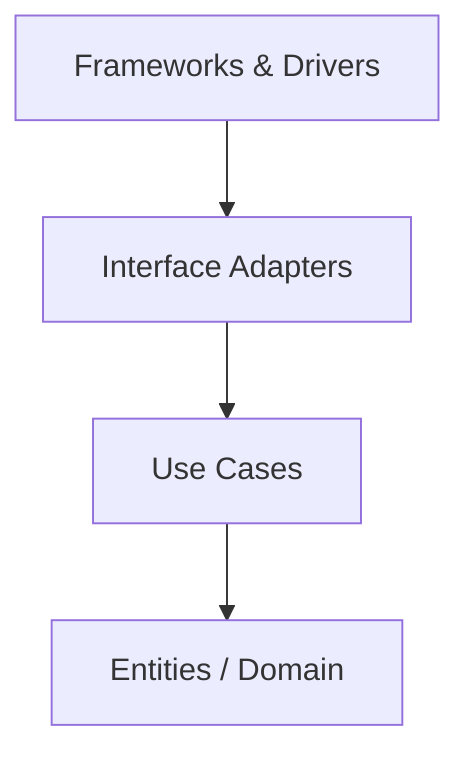
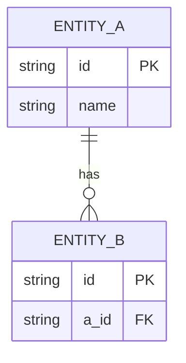

# システム設計書：{システム名}

> **メタ情報**
> - ドキュメントID: {DOC-XXX}
> - バージョン: {1.0}
> - 作成日: {YYYY-MM-DD}
> - 最終更新: {YYYY-MM-DD}
> - 作成者: {名前}
> - レビュー状況: {Draft / Reviewed / Approved}
> - 関連要件定義書: {要件定義書ID}

---

## 1. 概要

### 1-1. 目的
{システムが何を達成するか。1〜2段落}

### 1-2. 対象スコープ
{含む範囲 / 含まない範囲}

### 1-3. 前提条件
{技術的・組織的制約の前提}

### 1-4. 用語定義
| 用語 | 定義 |
|---|---|
| {用語} | {定義} |

---

## 2. 要件との対応

| 要件ID | 要件内容 | 優先度 | 対応モジュール | 設計上の対応 |
|---|---|---|---|---|
| {REQ-001} | {内容} | Must | {モジュール名} | {対応内容} |

---

## 3. アーキテクチャ設計

### 3-1. アーキテクチャスタイル
- **採用スタイル**: {モノリス / マイクロサービス / モジュラモノリス / サーバーレス / イベント駆動 / CQRS}
- **選定理由**: {なぜこのスタイルか}
- **検討した代替案と却下理由**:
  - {代替案A}: {却下理由}
  - {代替案B}: {却下理由}

### 3-2. C4 Context 図

```mermaid
graph LR
  User([利用者]) --> System[{システム名}]
  System --> ExtA[外部システムA]
  System --> ExtB[外部システムB]
```

### 3-3. C4 Container 図

```mermaid
graph TB
  subgraph System[{システム名}]
    Web[Web Frontend]
    API[API Server]
    DB[(Database)]
    Queue[Message Queue]
    Worker[Worker]
  end
  User([利用者]) --> Web
  Web --> API
  API --> DB
  API --> Queue
  Queue --> Worker
  Worker --> DB
```

---

## 4. モジュール設計

### 4-1. ドメイン分析
- **ユビキタス言語**: {業務用語の統一定義}
- **境界付けられたコンテキスト**: {コンテキスト一覧}
- **コンテキストマップ**: {コンテキスト間関係}

### 4-2. モジュール構成

| モジュール | 責務 | 主要IF | 依存先 |
|---|---|---|---|
| {モジュール名} | {責務} | {IF名} | {依存モジュール} |

### 4-3. クリーンアーキテクチャ層構成



---

## 5. データ設計

### 5-1. ER図



### 5-2. ストレージ選定
| データ種別 | ストレージ | 選定理由 |
|---|---|---|
| {データ種別} | {RDB / KVS / etc} | {理由} |

### 5-3. データライフサイクル
- **生成**: {タイミング・責任モジュール}
- **更新**: {タイミング・責任モジュール}
- **参照**: {タイミング・責任モジュール}
- **削除/アーカイブ**: {タイミング・責任モジュール}

---

## 6. IF設計

### 6-1. API一覧
| IF ID | エンドポイント | メソッド | リクエスト | レスポンス | 認可 |
|---|---|---|---|---|---|
| {IF-001} | {/path} | {GET} | {params} | {body} | {認可要件} |

### 6-2. イベント/メッセージング
{非同期メッセージ・イベントがある場合}

### 6-3. 外部システムIF
| 外部システム | 方向 | プロトコル | 認証方式 | 用途 |
|---|---|---|---|---|
| {システム名} | {送信/受信} | {REST/MQ/etc} | {方式} | {用途} |

---

## 7. 非機能要件の実現方策

| 品質特性 | 要件 | 設計対応 |
|---|---|---|
| 機能適合性 | {要件} | {対応} |
| 信頼性 | {要件} | {対応} |
| 性能効率性 | {要件} | {対応} |
| 使用性 | {要件} | {対応} |
| 保守性 | {要件} | {対応} |
| 移植性 | {要件} | {対応} |
| セキュリティ | {要件} | {対応} |
| 互換性 | {要件} | {対応} |

---

## 8. セキュリティ設計

### 8-1. 認証認可
{認証方式・認可モデル}

### 8-2. データ保護
{暗号化・マスキング・アクセス制御}

### 8-3. STRIDE脅威モデリング結果
| 脅威カテゴリ | 対象 | リスク | 対策 |
|---|---|---|---|
| Spoofing | {対象} | {リスク} | {対策} |
| Tampering | {対象} | {リスク} | {対策} |
| Repudiation | {対象} | {リスク} | {対策} |
| Information Disclosure | {対象} | {リスク} | {対策} |
| Denial of Service | {対象} | {リスク} | {対策} |
| Elevation of Privilege | {対象} | {リスク} | {対策} |

---

## 9. 運用設計

### 9-1. デプロイ構成
{デプロイ手法・環境構成}

### 9-2. 監視・アラート
{メトリクス・ログ・アラート閾値}

### 9-3. バックアップ・リカバリ
{バックアップ方式・RTO/RPO・リカバリ手順}

### 9-4. ログ・監査
{ログ種別・保持期間・監査要件}

---

## 10. 設計判断記録（ADR）

> 個別ADRは `docs/adr/ADR-XXX-{title}.md` としても保存可能。ここでは要約を記載。

### ADR-001: {決定事項タイトル}
- **ステータス**: Accepted
- **決定**: {採用した選択肢}
- **理由**: {根拠}
- **影響**: {トレードオフ}

---

## 11. アーキテクチャ評価（ATAM）

### 11-1. 品質属性シナリオ
| シナリオID | 品質属性 | 環境 | 刺激 | 応答 | 測定値 |
|---|---|---|---|---|---|
| {QA-001} | {性能} | {環境} | {刺激} | {応答} | {測定値} |

### 11-2. リスク・感度ポイント・トレードオフ
| 種別 | 対象 | 内容 |
|---|---|---|
| リスク | {対象} | {内容} |
| 感度ポイント | {対象} | {内容} |
| トレードオフ | {対象} | {相反する品質属性} |

---

## 12. 未解決事項・後追い課題

- [ ] {課題1}
- [ ] {課題2}

---

## 変更履歴

| バージョン | 日付 | 変更者 | 変更内容 |
|---|---|---|---|
| 1.0 | {YYYY-MM-DD} | {名前} | 初版作成 |