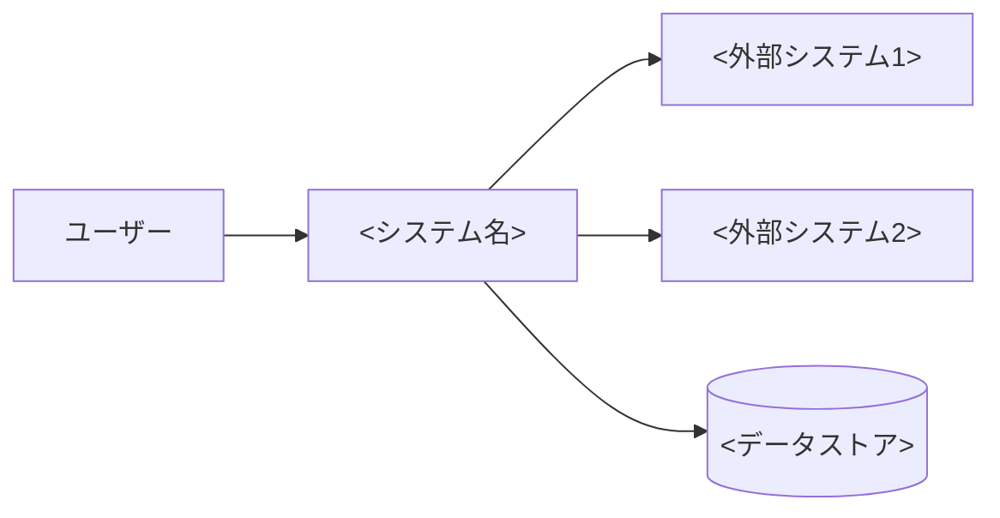
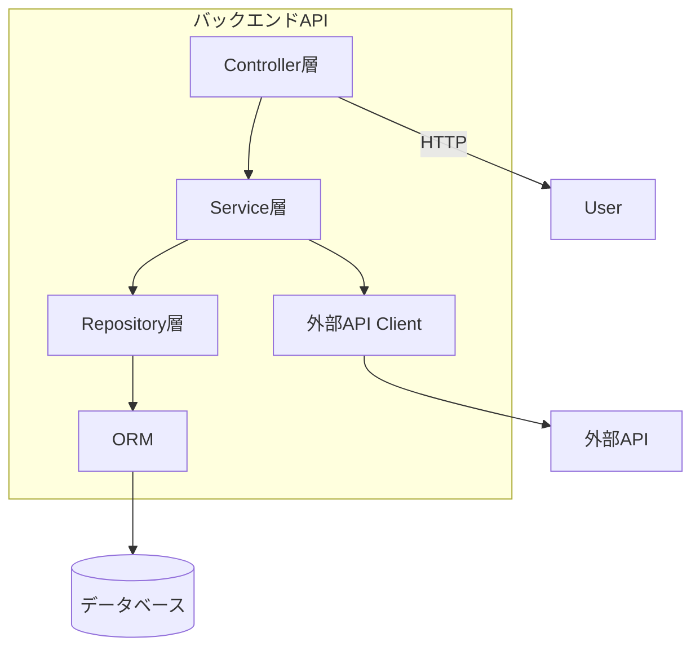
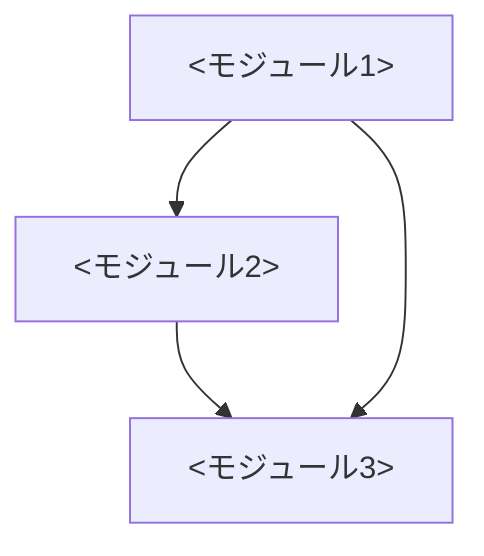
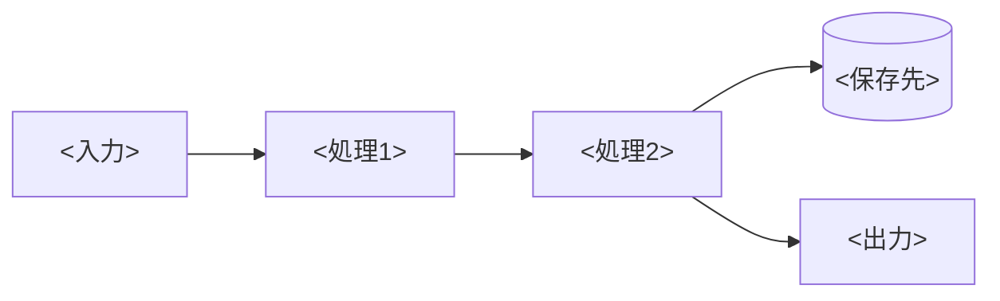
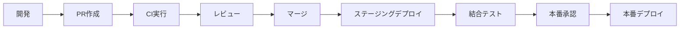

# <システム名> アーキテクチャドキュメント

<!-- 記入ガイド:
- 想定読者: 開発者（システムを開発・拡張する人）
- 目的: システム全体を理解し、拡張・保守できるようにする
- 技術用語OK・略語OK
- C4モデル（Context/Container/Component）で構成を描く
- Mermaidで図を描く（テキストベースで保守しやすいため）
- 詳細はADR（Architecture Decision Record）を参照
-->

## 概要

<システム名> は、<目的・用途> を提供するシステムです。

- **責務**: <システムが担う責務>
- **対象ユーザー**: <ユーザー層>
- **スケール**: <想定ユーザー数・トラフィック>

## アーキテクチャ構成

### Context（システム全体）

<!-- C4レベル1: システムと外部システムの関係 -->



**外部システムとの関係:**

| 外部システム | 接続方式 | 用途 | SLA |
|---|---|---|---|
| <外部システム1> | <HTTP/gRPC等> | <用途> | <SLA> |
| <外部システム2> | <方式> | <用途> | <SLA> |

### Container（コンテナ構成）

<!-- C4レベル2: 主要なコンテナ（アプリ・DB・キュー等） -->

```mermaid
flowchart TB
    subgraph <システム名>
        FE[フロントエンド\n<技術>] --> BE[バックエンドAPI\n<技術>]
        BE --> DB[(データベース\n<技術>)]
        BE --> Cache[(キャッシュ\n<技術>)]
        BE --> Queue[メッセージキュー\n<技術>]
    end
    User --> FE
```

**コンテナ一覧:**

| コンテナ | 技術 | 役割 | 通信 |
|---|---|---|---|
| フロントエンド | <技術> | <役割> | <通信方式> |
| バックエンドAPI | <技術> | <役割> | <通信方式> |
| データベース | <技術> | <役割> | - |
| キャッシュ | <技術> | <役割> | - |

### Component（コンポーネント構成）

<!-- C4レベル3: バックエンドAPI内の主要コンポーネント -->



## モジュール構成

### モジュール一覧

| モジュール | 責務 | 主要クラス | 依存先 |
|---|---|---|---|
| <モジュール1> | <責務> | <クラス名> | <依存先> |
| <モジュール2> | <責務> | <クラス名> | <依存先> |
| <モジュール3> | <責務> | <クラス名> | <依存先> |

### 依存関係図



### ディレクトリ構成

```
<プロジェクト名>/
├── src/
│   ├── <モジュール1>/
│   │   ├── controller/
│   │   ├── service/
│   │   └── repository/
│   ├── <モジュール2>/
│   └── shared/
├── tests/
└── docs/
```

## データ設計

### ER図

```mermaid
erDiagram
    <エンティティ1> ||--o{ <エンティティ2> : "<関係>"
    <エンティティ1> {
        <型> id PK
        <型> <フィールド1>
        <型> <フィールド2>
    }
    <エンティティ2> {
        <型> id PK
        <型> <フィールド1>
        <型> <エンティティ1>_id FK
    }
```

### データフロー



## インターフェース設計

### API概要

<!-- 詳細はAPI仕様書を参照 -->

- **スタイル**: <REST / GraphQL / gRPC>
- **認証**: <方式>
- **詳細**: [API仕様書](api-spec-summary.md)

### 外部連携IF

| 外部システム | 通信方式 | 認証 | リトライ | タイムアウト |
|---|---|---|---|---|
| <外部システム1> | <方式> | <認証> | <回数>回 | <秒>秒 |
| <外部システム2> | <方式> | <認証> | <回数>回 | <秒>秒 |

## 非機能要件の実現方式

### 性能

| 項目 | 目標値 | 実現方式 |
|---|---|---|
| レスポンスタイム | < <ms> | <方式（キャッシュ・インデックス等）> |
| スループット | < <RPS> | <方式> |
| 同時接続数 | < <数> | <方式> |

### 可用性

| 項目 | 目標値 | 実現方式 |
|---|---|---|
| SLO | < %> | <冗長化・フェイルオーバー> |
| RTO | <時間> | <方式> |
| RPO | <時間> | <方式> |

### セキュリティ

- **認証・認可**: <方式>
- **通信の暗号化**: <方式>
- **脅威モデリング**: STRIDEで実施（詳細は設計書参照）

### 監視

- **メトリクス**: <ツール>（<監視項目>）
- **ログ**: <ツール>（<ログレベル>）
- **アラート**: <ツール>（<閾値>）
- **詳細**: [運用手順書](runbook.md)

## 技術選定

<!-- 各技術の選定理由。詳細はADRを参照 -->

| 分類 | 採用技術 | 理由 | ADR |
|---|---|---|---|
| 言語 | <言語> | <理由> | ADR-001 |
| FW | <FW> | <理由> | ADR-002 |
| DB | <DB> | <理由> | ADR-003 |
| インフラ | <インフラ> | <理由> | ADR-004 |

## デプロイ構成

### 環境一覧

| 環境 | 用途 | URL | デプロイ方式 |
|---|---|---|---|
| 開発 | 開発者ローカル | <URL> | 手動 |
| ステージング | 結合テスト・検証 | <URL> | CI/CD |
| 本番 | 本番運用 | <URL> | CI/CD（承認付き） |

### デプロイフロー



## 今後の拡張予定

<!-- ロードマップ・拡張予定 -->

- <拡張予定1>
- <拡張予定2>
- <拡張予定3>

---

*このアーキテクチャドキュメントの最終更新日: <YYYY-MM-DD>*
*対象バージョン: <バージョン番号>*