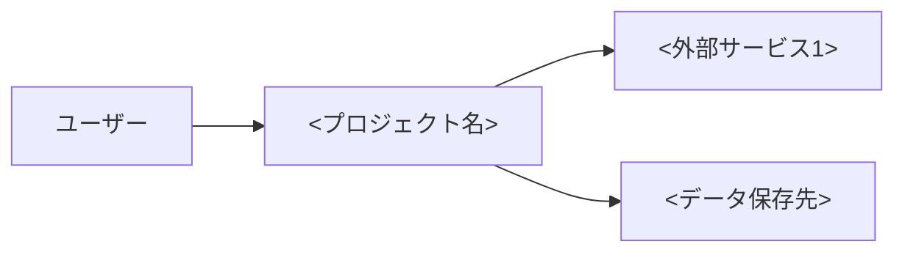

# <プロジェクト名>

<!-- 記入ガイド:
- 想定読者: プロジェクト外の方（顧客・取引先・非技術者）
- 目的: プロジェクトの概要・目的・価値を伝える
- 技術的詳細は最小限にし、ストーリー形式で構成する
- 専門用語は避けるか、初出時に平易な言葉で説明する
- 1〜2ページ程度で完結させる
-->

## 概要

<!-- 一言で何ができるか。30文字以内を目安に -->

<プロジェクト名> は、<解決する課題> を解決する <プロダクトの種類（Webアプリ/CLIツール/ライブラリ等）> です。

## 目的・背景

<!-- なぜこのプロジェクトがあるか。2〜3段落で -->

このプロジェクトは、<背景・きっかけ> という課題に対処するために開始されました。

<課題の詳細・従来の問題点>

<プロジェクトが目指す解決策の方向性>

## 主な機能

<!-- 機能一覧（3〜7個）。各機能は1文で。専門用語は避ける -->

1. **<機能1>** — <何ができるか>
2. **<機能2>** — <何ができるか>
3. **<機能3>** — <何ができるか>
4. **<機能4>** — <何ができるか>

## システム構成（簡易）

<!-- Mermaidで構成図を描く。技術的詳細より全体像を伝える -->

**使用技術スタック:**

| 分類 | 技術 |
|---|---|
| フロントエンド | <技術1> |
| バックエンド | <技術2> |
| データ保存 | <技術3> |
| インフラ | <技術4> |

## スクリーンショット・デモ

<!-- 画面キャプチャ・GIFを配置。images/ 配下に保存して相対パスで参照 -->

<画面の簡単な説明>

## 導入効果・価値

<!-- 期待される効果を3〜5個、箇条書きで -->

- **<効果1>**: <具体的な説明>
- **<効果2>**: <具体的な説明>
- **<効果3>**: <具体的な説明>

## お問い合わせ・リンク

<!-- 連絡先・関連リポジトリ・ライセンス -->

- **リポジトリ**: <GitHub URL>
- **ライセンス**: <ライセンス名>
- **お問い合わせ**: <連絡先>
- **詳細ドキュメント**: [セットアップガイド](docs/setup-guide.md) / [ユーザーマニュアル](docs/user-manual.md)

---

*このドキュメントの最終更新日: <YYYY-MM-DD>*