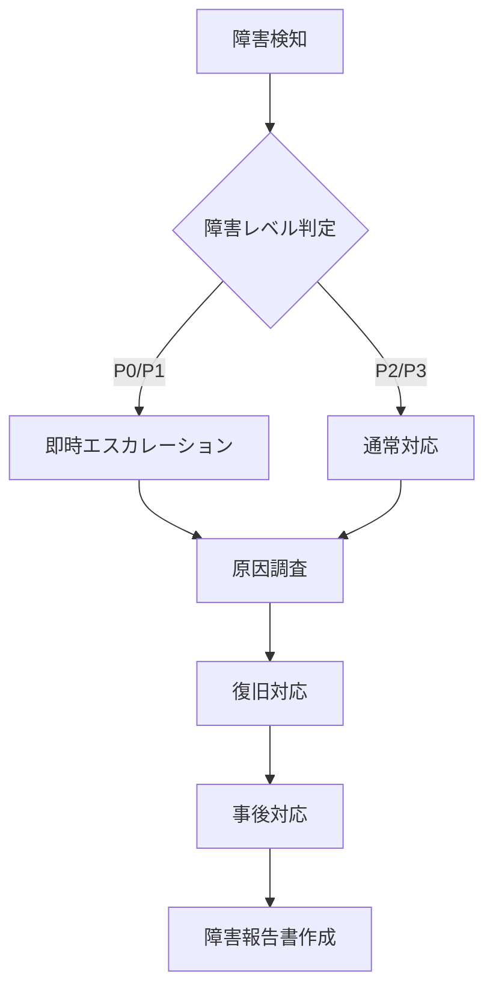

# <システム名> 運用手順書

<!-- 記入ガイド:
- 想定読者: 運用者（システムを運用・監視する人）
- 目的: 障害対応・定常運用を確実に実行できるようにする
- 技術用語OK・略語は定義
- 手順は番号付きで、コマンド・閾値付きで
- 障害シナリオ別に構成する
-->

## システム概要

<システム名> は、<目的・用途> を提供するシステムです。

### 構成図

```mermaid
flowchart TB
    subgraph <システム名>
        A[<コンポーネント1>] --> B[<コンポーネント2>]
        B --> C[<コンポーネント3>]
    end
    C --> D[<外部サービス>]
```

### コンポーネント一覧

| コンポーネント | 役割 | 技術 | 稼働環境 |
|---|---|---|---|
| <コンポーネント1> | <役割> | <技術> | <環境> |
| <コンポーネント2> | <役割> | <技術> | <環境> |
| <コンポーネント3> | <役割> | <技術> | <環境> |

## 定常運用

### 日次タスク

<!-- 毎日実施するタスク -->

| タスク | 実施時刻 | 所要時間 | 確認内容 |
|---|---|---|---|
| <タスク1> | <時刻> | <時間> | <確認内容> |
| <タスク2> | <時刻> | <時間> | <確認内容> |

**<タスク1> の手順:**

1. <手順1>
2. <手順2>
3. <手順3> — 確認: <確認ポイント>

### 週次タスク

| タスク | 実施曜日 | 所要時間 | 確認内容 |
|---|---|---|---|
| <タスク1> | <曜日> | <時間> | <確認内容> |

### 月次タスク

| タスク | 実施日 | 所要時間 | 確認内容 |
|---|---|---|---|
| <タスク1> | <日> | <時間> | <確認内容> |

## 監視項目

<!-- 監視項目・閾値・対応 -->

| 項目 | メトリクス | 正常範囲 | 警告閾値 | 異常閾値 | 対応 |
|---|---|---|---|---|---|
| CPU使用率 | `cpu_usage` | < 60% | 60-80% | > 80% | <対応内容> |
| メモリ使用率 | `memory_usage` | < 70% | 70-85% | > 85% | <対応内容> |
| ディスク使用率 | `disk_usage` | < 70% | 70-85% | > 85% | <対応内容> |
| レスポンスタイム | `response_time_ms` | < 500ms | 500-1000ms | > 1000ms | <対応内容> |
| エラー率 | `error_rate` | < 1% | 1-5% | > 5% | <対応内容> |
| <カスタム項目> | `<メトリクス名>` | <範囲> | <閾値> | <閾値> | <対応内容> |

## 障害対応

### 障害判定基準

| レベル | 定義 | 初動対応時間 |
|---|---|---|
| **P0（致命的）** | システム全体停止・データ損失リスク | 即時 |
| **P1（重大）** | 主要機能停止・代替手段なし | 15分以内 |
| **P2（中程度）** | 一部機能停止・代替手段あり | 1時間以内 |
| **P3（軽微）** | 性能劣化・見た目の問題 | 営業時間内 |

### 対応フロー



### エスカレーション

| レベル | エスカレーション先 | 連絡方法 |
|---|---|---|
| P0 | <責任者名> | <電話・Slack等> |
| P1 | <責任者名> | <連絡方法> |
| P2 | <担当者名> | <連絡方法> |
| P3 | <担当者名> | <連絡方法> |

### 障害別対応手順

#### <障害シナリオ1>

<!-- 各シナリオの構成: 症状 → 原因調査手順 → 復旧手順 → 事後対応 -->

**症状:**

- <症状1>
- <症状2>

**原因調査手順:**

1. <調査手順1>
   ```bash
   <確認コマンド>
   ```
2. <調査手順2>
3. <調査手順3>

**復旧手順:**

1. <復旧手順1>
   ```bash
   <復旧コマンド>
   ```
2. <復旧手順2>
3. <復旧手順3> — 確認: <確認ポイント>

**事後対応:**

- <事後対応1>
- <事後対応2>

#### <障害シナリオ2>

**症状:**

- <症状1>

**原因調査手順:**

1. <調査手順1>

**復旧手順:**

1. <復旧手順1>

## リカバリ手順

### バックアップからの復元

<!-- バックアップ・リストア手順 -->

**バックアップ構成:**

| 対象 | バックアップ方式 | 頻度 | 保存期間 | 保存先 |
|---|---|---|---|---|
| <対象1> | <方式> | <頻度> | <期間> | <保存先> |
| <対象2> | <方式> | <頻度> | <期間> | <保存先> |

**復元手順:**

1. <復元手順1>
2. <復元手順2>
3. <復元手順3>

### ロールバック手順

```bash
# 1. 現在のバージョン確認
<確認コマンド>

# 2. ロールバック実行
<ロールバックコマンド>

# 3. 動作確認
<確認コマンド>
```

**ロールバック判断基準:**

- エラー率 > 5% が5分以上継続
- レスポンスタイムが平常時の2倍以上に劣化
- 重大なデータ不整合の発生

## 連絡先

| 役割 | 氏名 | 連絡先 | 対応時間 |
|---|---|---|---|
| 運用責任者 | <氏名> | <連絡先> | 24時間 |
| 開発責任者 | <氏名> | <連絡先> | 営業時間 |
| インフラ責任者 | <氏名> | <連絡先> | 24時間 |
| セキュリティ責任者 | <氏名> | <連絡先> | 24時間 |

---

*この運用手順書の最終更新日: <YYYY-MM-DD>*
*対象バージョン: <バージョン番号>*