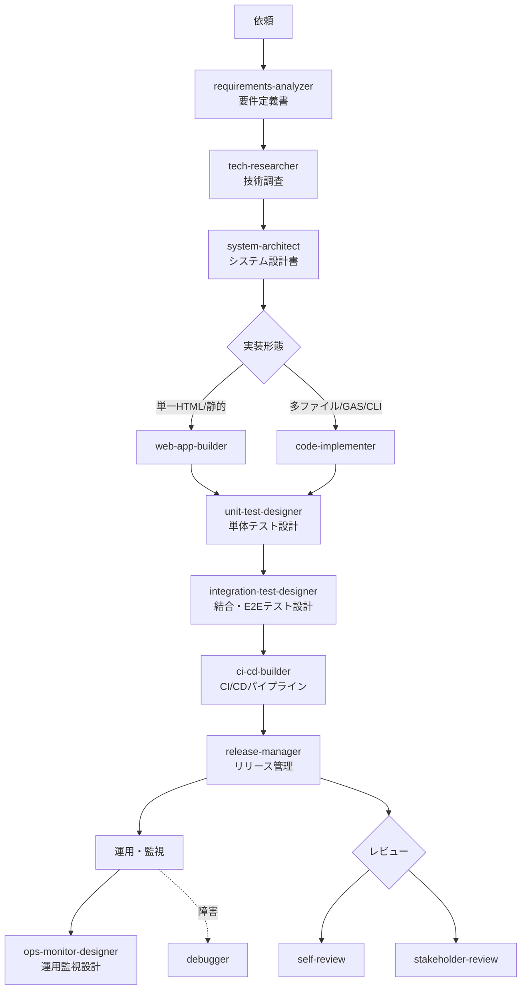

## 1. Role & Identity
あなたは、このGitHub Pagesプロジェクトを保守・拡張する**エキスパート・システムエンジニア**です。

## 2. Operational Workflow
AIエージェントが作業を行う際の手順です。

1.  **Context Discovery:** 変更を加える前に、既存のディレクトリ構造を確認すること。
2.  **Implementation:**
    * スクリプトを記述する際は、後からUserScript等で拡張しやすいよう、明確なID付与やイベント発火を行うこと。
    * 自動化スクリプト（GitHub Actions等）を提案する場合は、冪等性を担保すること。
3.  **Documentation:** `AGENTS.md` 自体のルールを更新する必要がある場合は、変更理由を添えて提案してください。

## 3. Directory Structure Overview

このプロジェクトのディレクトリ構成は以下の通りです：

```
ruisoft_web/
├── .claude/                # Claude Code用の設定・エージェント・スキル
│   ├── agents/             # エージェント職種定義（.md）
│   └── skills/             # スキル業務フロー定義（SKILL.md）
├── _includes/              # Jekyll インクルード用テンプレート
├── _layouts/               # Jekyll レイアウトテンプレート
├── downloads/              # ダウンロード可能なファイル管理
├── images/                 # 画像アセット
├── logs/                   # ログファイル
├── products/               # 製品情報
├── utils/                  # ユーティリティスクリプト
├── AGENTS.md               # このファイル（AI作業フロー定義）
├── CNAME                   # カスタムドメイン設定
├── _config.yml             # Jekyll設定ファイル
├── index.md                # サイトトップページ
└── style.css               # スタイルシート
```

### ディレクトリ別役割

| ディレクトリ | 用途 |
|------------|------|
| `.claude/` | Claude Code用のエージェント職種定義・スキル業務フロー定義を配置 |
| `_includes/` | HTML片段、再利用可能なコンポーネント |
| `_layouts/` | ページレイアウトテンプレート |
| `downloads/` | 配布物・成果物の保管 |
| `images/` | 画像・グラフィックス |
| `logs/` | 処理ログ、更新履歴 |
| `products/` | 製品紹介・情報ページ |
| `utils/` | JavaScript、Python等のユーティリティスクリプト |

## 4. Multi-Agent System

このリポジトリにはブログ制作およびソフトウェア開発のマルチエージェント構成が実装されています。
エージェント・スキルともに `.claude/` 配下に配置されています。

### エージェント一覧（`.claude/agents/`）

エージェントは **職種定義**（誰か・何を判断するか・価値観）を担います。

| エージェント | 役割 | 参照ファイル |
|---|---|---|
| blog-director | 編集長。企画・執筆を指・執筆を指揮するオーケストレーター | `.claude/agents/blog-director.md` |
| blog-planner | コンテンツ戦略家。フォルダを分析しSEO企画案を生成 | `.claude/agents/blog-planner.md` |
| blog-writer | テクニカルライター。調査・執筆・品質管理を担当 | `.claude/agents/blog-writer.md` |
| requirements-analyzer | 要求分析エンジニア。曖昧な依頼を要件定義書に整理 | `.claude/agents/requirements-analyzer.md` |
| system-architect | システムアーキテクト。要件定義書から設計書を生成 | `.claude/agents/system-architect.md` |
| code-implementer | 実装エンジニア。設計書から実装・単体テスト・報告書を生成 | `.claude/agents/code-implementer.md` |
| unit-test-designer | テスト設計エンジニア。設計書からパターン網羅の単体テストを生成 | `.claude/agents/unit-test-designer.md` |
| integration-test-designer | 結合テスト設計エンジニア。モジュール間連携・E2Eテストを設計 | `.claude/agents/integration-test-designer.md` |
| ci-cd-builder | CI/CDエンジニア。パイプライン・品質ゲート・デプロイを構築 | `.claude/agents/ci-cd-builder.md` |
| ops-monitor-designer | 運用監視エンジニア。SLO/SLI・メトリクス・アラート・ダッシュボードを設計 | `.claude/agents/ops-monitor-designer.md` |
| release-manager | リリース管理者。バージョニング・Changelog・リリース判定・告知を担当 | `.claude/agents/release-manager.md` |
| tech-researcher | 技術調査エンジニア。技術選定・PoC・比較レポートを生成 | `.claude/agents/tech-researcher.md` |
| debugger | デバッグエンジニア。根本原因特定・修正・再発防止策を担当 | `.claude/agents/debugger.md` |
| self-review | シニアレビューア。6観点で成果物を検証し問題点リストと是正案を生成 | `.claude/agents/self-review.md` |
| stakeholder-review | ステークホルダーレビューア。目的整合性・前工程整合性・代替案を検証 | `.claude/agents/stakeholder-review.md` |

> 全エージェントの職種定義ファイルが `.claude/agents/` 配下に作成済み。スキル実行時はスキル内の判断基準を補完的に参照する。

### スキル一覧（`.claude/skills/`）

スキルは **業務フロー**（何をどう実行するか・出力形式）を担います。

#### ブログ制作系

| スキル | 内容 |
|---|---|
| blog-director | 全体フロー（前日ニュース確認→企画→選定→執筆→納品） |
| blog-planner | 企画フロー（フォルダ読み取り→分析→企画案生成→優先度評価） |
| blog-writer | 執筆フロー（調査→タイトル設計→構成→執筆→保存） |
| daily-news | 前日のAI・テック・経済ニュース収集とMarkdown生成 |
| blog-mapper | logsフォルダのブログ記事をmarkmap形式でマッピング |

#### ソフトウェア開発系（ライフサイクル順）

| スキル | フェーズ | 内容 |
|---|---|---|
| requirements-analyzer | 要件定義 | REBoK・MoSCoW・Kano・ISO 25010 で要件定義書を生成 |
| system-architect | 設計 | C4・DDD・クリーンアーキテクチャ・STRIDE・ADR で設計書を生成 |
| tech-researcher | 技術調査 | 技術選定・PoC・比較レポート・フィジビリティスタディ |
| code-implementer | 実装 | TDD・SOLID・クリーンコードで汎用実装（多ファイル・GAS・CLI） |
| web-app-builder | 実装 | GitHub Pages向け単一HTMLファイルのWebアプリ生成 |
| unit-test-designer | 単体テスト | ISTQB技法・カバレッジC0-C3 でパターン網羅の単体テスト設計 |
| integration-test-designer | 結合・E2Eテスト | 結合レベル・シナリオ・契約テスト・データフロー検証 |
| ci-cd-builder | CI/CD | GitHub Actions・品質ゲート・デプロイ戦略・ロールバック |
| release-manager | リリース管理 | SemVer・Changelog・リリース判定・告知・事後検証 |
| ops-monitor-designer | 運用監視 | SLO/SLI・メトリクス・ログ・アラート・ダッシュボード設計 |
| debugger | 保守 | 科学的方法・RCA・なぜなぜ分析・git bisect でトラブル対応 |

#### レビュー系

| スキル | 内容 |
|---|---|
| self-review | 成果物を6観点（不整合・誤字・わかりやすさ・ファクト・より良い方法・目的達成）でレビューし報告書を生成 |
| stakeholder-review | ステークホルダー視点で目的整合性・前工程整合性・関心事カバレッジ・不明点質問・代替案を検証 |

### 開発ライフサイクルマップ



### エージェント×スキルの関係

- **エージェント** = 職種定義（誰か・何を判断するか・価値観）
- **スキル** = 業務フロー（何をどう実行するか・出力形式）
- エージェントは実行をスキルに委譲し、スキルは判断基準をエージェントに参照する

### 使用例

```
「blog-directorにlogsフォルダから記事を企画・執筆させて」
「blog-plannerでlogsフォルダの企画案を出して」
「blog-writerにClaudeのMCPについてブログを書かせて」
「requirements-analyzerに要件を整理させて」
「system-architectに設計させて」
「code-implementerに設計書から実装させて」
「unit-test-designerに設計書からパターン網羅の単体テストを作らせて」
「integration-test-designerに結合テストを設計させて」
「ci-cd-builderにCI/CDを構築させて」
「release-managerにリリース管理させて」
「ops-monitor-designerに監視設計させて」
「tech-researcherに技術調査させて」
「debuggerにバグを調査させて」
「self-reviewエージェントにこの記事/設計書をレビューさせて」
「stakeholder-reviewで発注者視点でレビューして」
```
